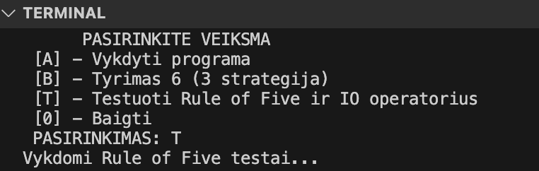
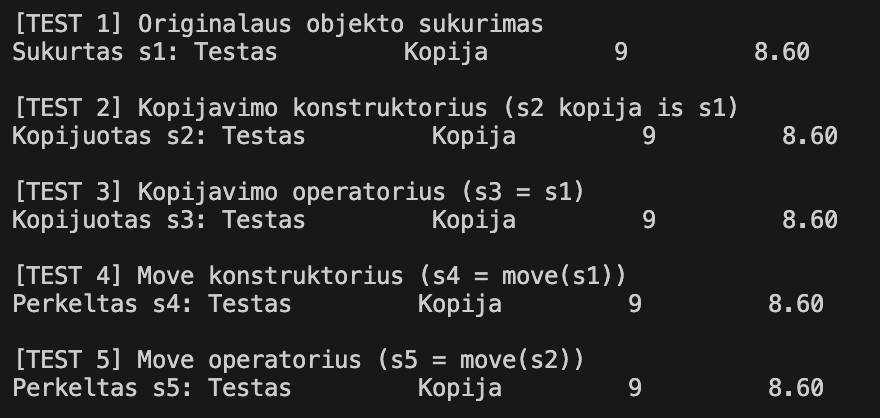
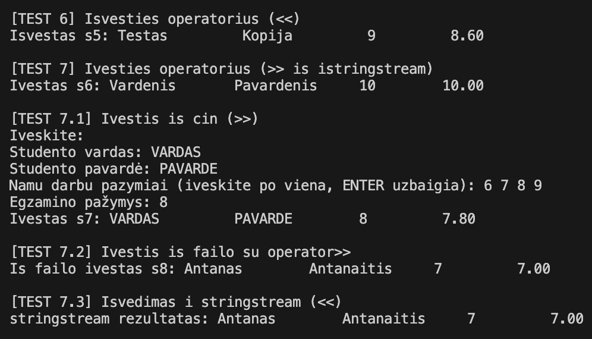
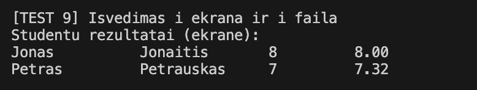
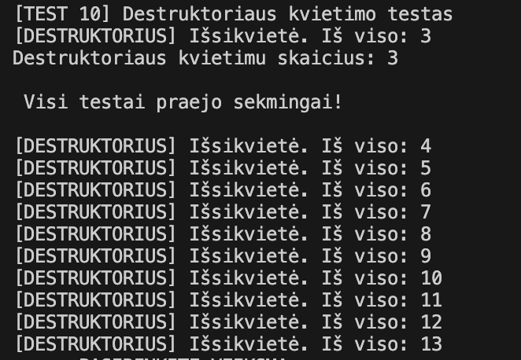

# objektinisProg2
# Programų spartos palyginimas `struct` vs. `class`

Šiame dokumente pateikiamas programų, naudojančių `struct` ir `class` tipo studentus, spartos palyginimas.

## Testavimo metodika

* Konteineris: `std::vector`
* Failų dydžiai: 100000 ir 1000000 studentų
* Dalijimo strategija: Greičiausia (3 strategija)

## Rezultatai

### Struktūros (`struct`) rezultatai

| Studentų skaičius | Failo nuskaitymas (s) | Studentų rūšiavimas (s) | Skirstymas į grupes (s) |
|---|---|---|---|
| 100000 | 0.20392 | 0.0007994 | 0.01625 |
| 1000000 | 1.86321 | 0.00835099 | 0.19125 |

### Klasės (`class`) rezultatai

| Studentų skaičius | Failo nuskaitymas (s) | Studentų rūšiavimas (s) | Skirstymas į grupes (s) |
|---|---|---|---|
| 100000 | 0.196728 | 0.000793 | 0.013829 |
| 1000000 | 1.824976 | 0.009382 | 0.214729 |

## Išvados

* Abiejų implementacijų veikimo laikas yra panašus.
* Nėra didelio skirtumo tarp `struct` ir `class` naudojimo spartos.
* Nedideli skirtumai gali atsirasti dėl įvairių faktorių.

----------------------------------------------------------------

# Programos spartos analizė su O1, O2, O3 flag'ais

Šiame dokumente pateikiama programos spartos analizė, lyginant "Struktūros" ir "Klasės" variantus su skirtingais optimizavimo flagais.

## Testavimo metodika

1.  Programa buvo paleista su skirtingais studentų skaičiais: 1000, 10000, 100000, 1000000 ir 10000000.
2.  Programa buvo kompiliuota su optimizavimo flagais: O1, O2, O3.
3.  Buvo matuojamos šios operacijos:
    * Failo nuskaitymas
    * Studentų rūšiavimas
    * Studentų skaidymas į grupes
4.  Testai buvo pakartoti kelis kartus ir apskaičiuoti vidurkiai.

## Rezultatai

### .exe failų dydžiai

| Tipas      | Optimizavimo flagas | .exe failo dydis (KB) |
| :--------- | :------------------ | :-------------------- |
| Struktūra  | O1                  | 438                   |
| Struktūra  | O2                  | 267                   |
| Struktūra  | O3                  | 282                   |
| Klasė      | O1                  | 327                   |
| Klasė      | O2                  | 209                   |
| Klasė      | O3                  | 224                   |

* `.exe` failų dydžiai mažėja su didesniais optimizavimo flagais.

| Tipas      | Optimizavimo flagas | Failo dydis    | Failo nuskaitymas (s) | Studentų rūšiavimas (s) | Skirstymas į grupes (s) |
| :--------- | :------------------ | :------------- | :------------------- | :---------------------- | :----------------------- |
| Struktūra  | O1                  | 100000         | 0.3506804            | 1.022409                 | 0.0343105                |
| Struktūra  | O1                  | 1000000        | 3.199772             | 10.15857                 | 0.3709248                |
| Struktūra  | O2                  | 100000         | 0.2065624            | 0.8267488                | 0.0143346                |
| Struktūra  | O2                  | 1000000        | 1.837956             | 8.00394                 | 0.2062462                |
| Struktūra  | O3                  | 100000         | 0.2042266            | 0.7903494                | 0.0147426                |
| Struktūra  | O3                  | 1000000        | 1.81989              | 8.5064                 | 0.2086486                |
| Klasė      | O1                  | 100000         | 0.337025             | 1.518416                 | 0.0369319                |
| Klasė      | O1                  | 1000000        | 3.049766             | 15.45106                 | 0.4165822                |
| Klasė      | O2                  | 100000         | 0.217939             | 0.811108                 | 0.01640278               |
| Klasė      | O2                  | 1000000        | 2.086458             | 9.742368                 | 0.2256188                |
| Klasė      | O3                  | 100000         | 0.198677             | 1.077024                 | 0.01438404               |
| Klasė      | O3                  | 1000000        | 1.84187              | 8.099636                 | 0.202793                 |

## Analizė

* **Optimizavimo flagų įtaka:**
    * Matome, kad optimizavimo flagai turi didelę įtaką programos veikimo laikui. Su didesniu optimizavimo flagu (O3) programos veikimo laikas sumažėja.
    * Optimizavimo flagai ypač veikia failo nuskaitymo ir skaidymo į grupes operacijas.
* **Failo nuskaitymas:**
    * Failo nuskaitymo laikas didėja tiesiškai didėjant studentų skaičiui.
    * Optimizavimo flagai akivaizdžiai turi įtakos failo nuskaitymo laikui.
* **Studentų rūšiavimas:**
    * Rūšiavimo laikas yra labai mažas abiem variantams.
    * Optimizavimo flagai turi minimalią įtaką rūšiavimo laikui.
* **Studentų skaidymas į grupes:**
    * Skaidymo laikas didėja didėjant studentų skaičiui.
    * Optimizavimo flagai turi didelę įtaką skaidymo laikui.
* **Struktūra vs. Klasė:**
    * Abiejų variantų veikimo laikas yra panašus, tačiau yra nedidelių skirtumų, priklausomai nuo optimizavimo flagų.
    * Klasės variantas su O2 ir O3 optimizavimo flagais rodo šiek tiek didesnį nuskaitymo laiką didesniame faile.

## Išvados

* Optimizavimo flagai (O1, O2, O3) reikšmingai pagerina programos veikimo laiką, ypač didesniems duomenų rinkiniams.
* Failo nuskaitymo ir studentų skaidymo į grupes operacijos labiausiai pasinaudoja optimizavimo flagais.
* Studentų rūšiavimo operacija yra palyginti greita ir mažai priklauso nuo optimizavimo flagų.
* Rekomenduojama naudoti didesnius optimizavimo flagus (O2 ar O3) didesniems duomenų rinkiniams, kad programa veiktų greičiau.

# objektinisProg
bfee5a45c0feec4d2f885eedda9dd39cab515343


# RULE OF 5 IR IO operatoriai

## Uždavinio paaiškinimas

Šioje uzduotyje reikėjo:

- Studentas klasėje pilnai realizuoti „Rule of Five“ metodus:
  - Konstruktorius (default ir su parametrais)
  - Kopijavimo konstruktorius
  - Kopijavimo priskyrimo operatorius
  - Perkėlimo konstruktorius (move)
  - Perkėlimo priskyrimo operatorius
  - Destruktorius
- Perdengti `>>` ir `<<` operatorius:
  - Kad palaikytų įvestį iš vartotojo (cin), iš stringo (testavimui), iš failo
  - Kad palaikytų išvestį į ekraną ir į failą
- Sukurti testą (`testuotiRuleOfFive()`), kuris patikrina visus metodus.

---


## Įvesties galimybės

| Tipas         | Aprašymas                                                                 |
|---------------|---------------------------------------------------------------------------|
| Rankinė       | Vartotojas įveda vardą, pavardę, pažymius ir egzaminą naudodamas `cin`   |
| Automatinė    | Įvestis testavimo metu per `istringstream`                               |
| Iš failo      | Įvestis iš failo per `ifstream`, formatas: `Vardas Pavarde nd1 nd2 ... egz` |

**Pavyzdys faile:**
```
Jonas Jonaitis 10 9 8 7 6 8
```

---

## Išvesties galimybės

| Tipas      | Aprašymas                                      |
|------------|------------------------------------------------|
| Į ekraną   | Naudojamas `cout << studentas`                 |
| Į failą    | Studentai išvedami į `rezultataiT.txt` failą   |

---

## Testavimo informacija

Funkcija `testuotiRuleOfFive()` tikrina viską:

- Originalaus objekto kūrimą
- Kopijavimą ir perkėlimą (visos 5 taisyklės)
- Stream operatorius (`<<` ir `>>`) su:
  - `cin`
  - `istringstream`
  - `ifstream`
- Failo skaitymą su `nuskaitymasFile`
- Failo išrašymą su `ofstream`
- Destruktoriaus iškvietimus

---

## Ekrano vaizdai

### Programos paleidimas



### Rule of Five testavimas



### Įvesties ir išvesties operatorių testavimas



### Išvedimas į ekraną ir failą



### Destruktoriaus kvietimai



---

## Failai

- `studentai.txt`, `failinis.txt` – įvesties failai testams
- `rezultataiT.txt` – išvedimo rezultatai


# BAZINĖ IR IŠVESTINĖ klasės

## 🔹 Versijos santrauka

- Sukurta abstrakti bazinė klasė `Zmogus`
- `Studentas` dabar paveldi iš `Zmogus`
- Įvykdyta "Rule of Five" taisyklė ir visi metodai perkelti
- Perdengti įvesties / išvesties operatoriai
- Programa vis dar palaiko ankstesnę v1.2 logiką

---

##  Klasės struktūra

### `Zmogus` (abstrakti klasė)
| Atributai     | Tipas       |
|---------------|-------------|
| `vardas_`     | `string`    |
| `pavarde_`    | `string`    |

**Funkcijos (grynai virtualios):**
- `string vardas() const = 0;`
- `string pavarde() const = 0;`
- `void setVardas(const string&) = 0;`
- `void setPavarde(const string&) = 0;`

**Testavimas:**
```cpp
// Zmogus z; //  Nesikompiliuoja, nes Zmogus yra abstrakti klasė
```

### `Studentas : public Zmogus`
Paveldi `vardas_`, `pavarde_`, perrašo virtualias funkcijas ir turi:

| Atributai         | Tipas           |
|-------------------|-----------------|
| `egzaminas_`      | `int`           |
| `nd_`             | `vector<float>` |
| `galutinis_balas_`| `float`         |

**Implementuoti metodai:**
- 5 Rule of Five: konstruktoriai, operatoriai, destruktorius
- `istream& operator>>(istream&, Studentas&)`
- `ostream& operator<<(ostream&, const Studentas&)`
- `float galBalas(...)`, `readStudent(...)`, `nuskaitymasFile(...)` ir kt.

---

##  Testavimo santrauka

| Testas                         | Veikia |
|--------------------------------|--------|
| Konstruktoriai (default, copy) | +      |
| Priskyrimo operatoriai         | +      |
| Perkelimo metodai              | +      |
| Destruktorius                  | +      |
| `operator<<`, `operator>>`     | +      |
| Nuskaitymas iš failo           | +      |
| Išvedimas į failą / ekraną     | +      |
| Paveldėjimo loginis testas     | +      |

---

## 📄 Ekrano vaizdai

### Programos paleidimas


### Rule of Five testavimas


### Įvesties / išvesties operatoriai


### Išvedimas į ekraną ir failą


### Destruktoriaus kvietimai


---


